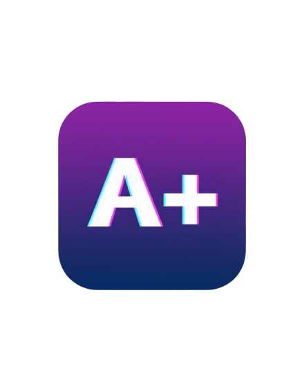
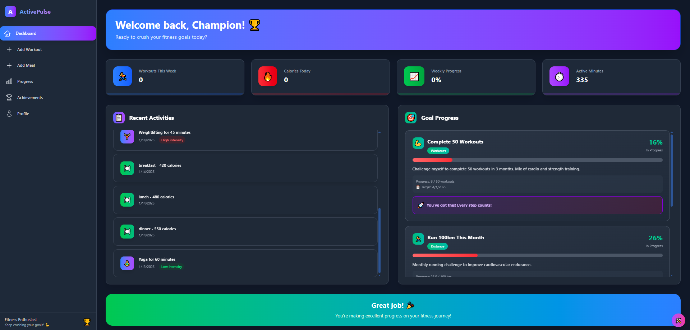
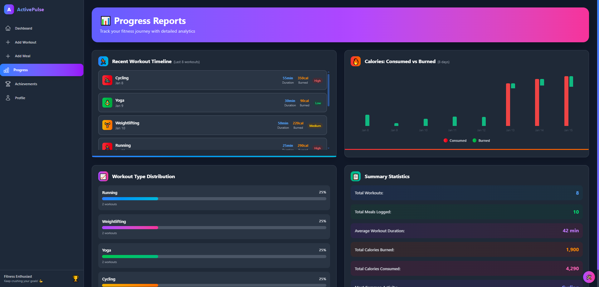
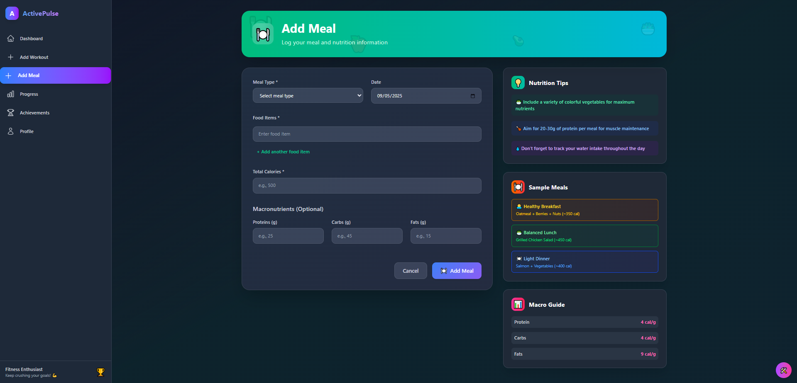
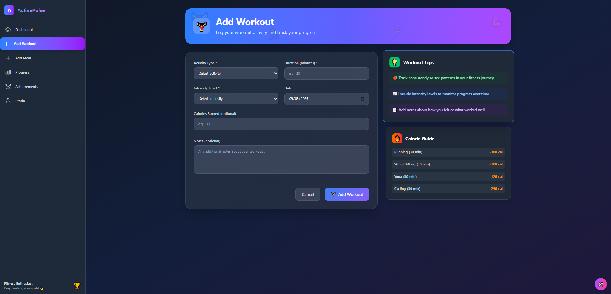
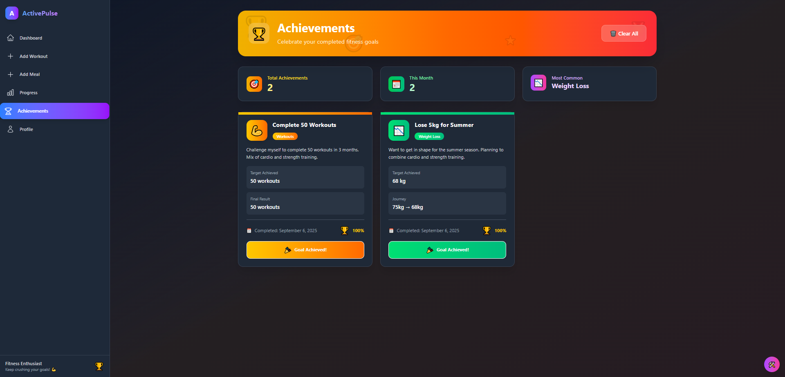
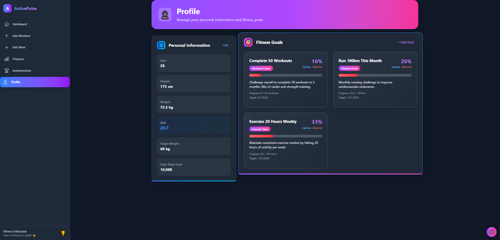

# 🏋️‍♂️ ActivePulse - Fitness Tracker

<p align="center">
  
</p>

<p align="center">
  
  
  
  
  
  
  
</p>

A comprehensive fitness tracking application built with React and Vite, featuring workout logging, meal tracking, progress analytics, and goal management.



## ✨ Features

### 🎯 Comprehensive Tracking
- **Workout Logging** - Track different activity types, duration, intensity, and calories burned
- **Meal Tracking** - Log meals with detailed nutrition information including macros
- **Progress Analytics** - Visual charts and statistics to monitor your fitness journey
- **Goal Management** - Set and track custom fitness goals with progress indicators

### 📊 Dashboard & Analytics


- Real-time fitness statistics
- Weekly progress tracking
- Calorie consumption vs burn analysis
- Workout type distribution charts
- Recent activity timeline

### 🍽️ Nutrition Management


- Detailed meal logging with macro tracking
- Calorie counting and nutrition guidelines
- Sample meal suggestions
- Macro calculator (Protein, Carbs, Fats)

### 💪 Workout Management


- Multiple activity types (Running, Weightlifting, Yoga, Cycling)
- Intensity levels (Low, Medium, High)
- Duration and calorie burn tracking
- Workout tips and calorie guides

### 🏆 Achievement System


- Goal completion tracking
- Achievement badges and rewards
- Progress celebration
- Achievement statistics

### 👤 Profile & Goals


- Personal information management
- BMI calculation
- Custom goal creation and tracking
- Progress monitoring

## 🛠️ Tech Stack

### Frontend
- **React 18** - Modern React with hooks and functional components
- **Vite** - Fast build tool and development server
- **React Router Dom** - Client-side routing
- **Tailwind CSS** - Utility-first CSS framework
- **Heroicons** - Beautiful SVG icons

### Deployment
- **Docker** - Containerization with multi-stage builds
- **Nginx** - Production web server
- **Alpine Linux** - Lightweight container base

## 🚀 Getting Started

### Prerequisites
- Node.js 18+ 
- npm or yarn
- Docker (for containerized deployment)

### Installation

1. **Clone the repository**
```bash
git clone https://github.com/yourusername/activepulse.git
cd activepulse
```

2. **Install dependencies**
```bash
npm install
```

3. **Start development server**
```bash
npm run dev
```


## 🐳 With Docker

1. **Pull the image**
```bash
docker pull ahmed218/activepluse
```

2. **Run the container**
```bash
docker run -d -p 3000:80 --name activepulse ahmed218/activepulse:latest
```

3. **Access the application**
Open `http://localhost:3000`


## 🎨 Key Features in Detail

### Data Persistence
- **Local Storage** - All data persists locally in browser storage
- **Context State Management** - Centralized state using React Context
- **Automatic Saving** - Data saves immediately on form submission

### Responsive Design
- **Mobile-First** - Optimized for mobile devices
- **Tablet & Desktop** - Scales beautifully across all screen sizes
- **Dark Mode** - Consistent dark theme throughout the application

### User Experience
- **Intuitive Navigation** - Easy-to-use sidebar navigation
- **Form Validation** - Real-time form validation and error handling
- **Visual Feedback** - Loading states, animations, and hover effects
- **Progress Tracking** - Visual progress bars and achievement celebrations


## 📝 License

This project is licensed under the MIT License - see the [LICENSE](LICENSE) file for details.


---

<div align="center">
  <p>Built with ❤️ for fitness enthusiasts</p>
  <p>Start your fitness journey with ActivePulse today! 🏋️‍♂️</p>
</div>